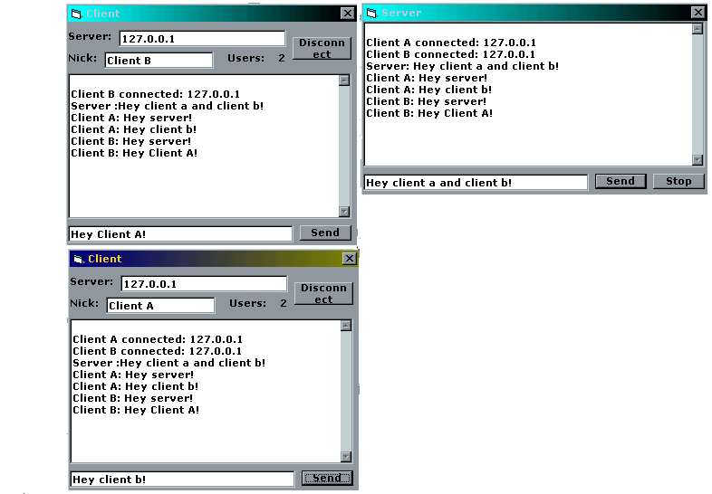



## Multiple Winsock Connections

### Description

This demonstrates a winsock server that accept multiple connections.
 
### More Info
 
You'll need mswinsck.ocx

             |
---                |---
**Submitted On**   |2001-08-08 15:33:00
**By**             |[ttb](https://github.com/Planet-Source-Code/PSCIndex/blob/master/ByAuthor/ttb.md)
**Level**          |Intermediate
**User Rating**    |4.5 (18 globes from 4 users)
**Compatibility**  |VB 6\.0
**Category**       |[Internet/ HTML](https://github.com/Planet-Source-Code/PSCIndex/blob/master/ByCategory/internet-html__1-34.md)
**World**          |[Visual Basic](https://github.com/Planet-Source-Code/PSCIndex/blob/master/ByWorld/visual-basic.md)
**Archive File**   |[Multiple W24349892001\.zip](https://github.com/Planet-Source-Code/ttb-multiple-winsock-connections__1-26029/archive/master.zip)

